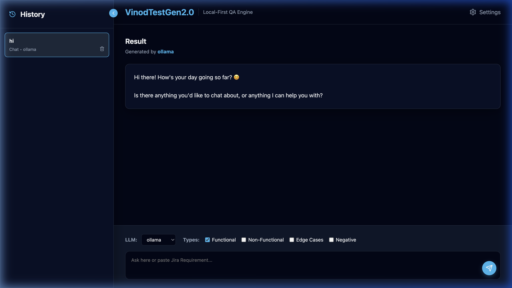

# VinodTestGen2.0 🚀



> **Preview Demo**
> 

**VinodTestGen2.0** is a local-first, LLM-powered application designed to transform Jira requirements into comprehensive, structured test cases. It supports multiple LLM providers (Ollama, Groq, OpenAI, Gemini, etc.) and features a premium dark-mode UI with persistent history and CSV export capabilities.

---

## 🛠️ Prerequisites

Before you begin, ensure you have the following installed:
- [Node.js](https://nodejs.org/) (v18 or higher recommended)
- [npm](https://www.npmjs.com/) (usually comes with Node.js)
- [Ollama](https://ollama.ai/) (Optional: Only if you plan to use local LLM generation)

---

## 🚀 Getting Started

Follow these steps to get the project up and running on your local machine.

### 1. Clone the Repository
```bash
git clone https://github.com/vinod7406/AITestCaseGen2x.git
cd AITestCaseGen2x
```

### 2. Setting Up the Backend
The backend is built with Node.js, Express, and TypeScript.
```bash
cd backend
npm install
npm run dev
```
*The backend server will start on **http://localhost:5001***.

### 3. Setting Up the Frontend
The frontend is built with React JS and Vite.
```bash
# Open a new terminal window/tab
cd frontend
npm install
npm run dev -- --port 5174
```
*The frontend application will be available at **http://localhost:5174***.

---

## ⚙️ Configuration

Once both servers are running:
1. Open your browser to `http://localhost:5174`.
2. Click the **Settings (Gear Icon)** in the top-right corner.
3. Configure your preferred LLM provider:
   - **Ollama**: Ensure Ollama is running (`ollama serve`). Default model is `gemma3:1b`.
   - **Cloud Providers**: Enter your API Key for Groq, OpenAI, Claude, or Gemini.
4. Click **"Test"** to verify connectivity and **"Save All"** to persist your settings.

---

## 🌟 Key Features
- **Smart Data Libraries (New!)**: Build resuable Knowledge Assets and Prompt Templates categorized into collapsible folders (e.g. `TestCaseCreation`, `BugReportTemplate`). Includes drag-and-drop template classification.
- **Context Asset Integration (New!)**: Seamlessly attach multi-format knowledge assets (`PRD`, `API`, `LOG`, etc.) dynamically into your prompts for highly constrained LLM generation.
- **Dynamic Template Formatting (New!)**: The generative backend automatically configures LLMs to output customized JSON that matches the exact data columns given by your Prompt Templates, enabling limitless table layouts.
- **Dynamic Grid View (New!)**: React UI tables automatically adapt their column headers and cell rendering dynamically based on the exact structure generated by your templates!
- **Expandable Workspace**: Fluid, resizable prompt layout supporting huge PRD paste-ins natively.
- **Expandable History & Routing**: Manage past test case generations with ease. Sidebar automatically routes back to main generation workspaces cleanly.
- **Categorized Generation**: Generate Functional, Non-functional, Edge Case, and Negative tests.
- **CSV Export**: Direct download of test cases for Jira import.

---

## 🏗️ Tech Stack
- **Frontend**: React JS, Lucide Icons, Vanilla CSS
- **Backend**: Node.js, TypeScript, Express
- **Storage**: Local JSON Persistence
- **API**: Axios
